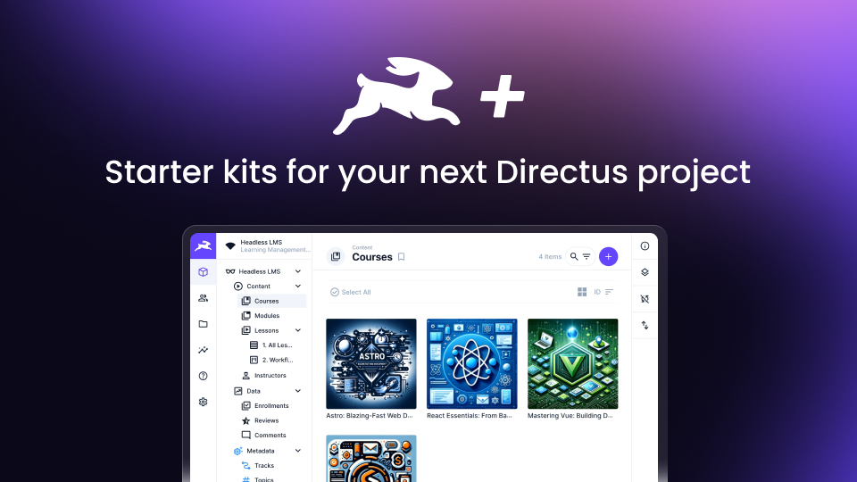

<a href="https://directus.io/plus" target="_blank">
    
    <h1 align="center">Directus +</h1>
</a>

<p align="center">Premium Directus instance templates to help you jump start your next project. Apply templates with <a href="https://github.com/directus-community/directus-template-cli"target="_blank">directus-template-cli</a>.
</p>

<p align="center">
  <a href="#-introduction"><strong>🚀 Introduction</strong></a> ·
  <a href="#-introduction"><strong>🗺️ Overview</strong></a> ·
  <a href="#-installation"><strong>💾 Installation</strong></a> ·
  <a href="#-documentation"><strong>📖 Documentation</strong></a>
</p>
<br/>
<br />

# 🚀 Introduction

Welcome to Directus+ 👋. We're happy you're here.

Please don't hesitate to send us your feedback and suggestions on documentation and the starter kits.

Directus+ is a companion subscription for Directus community members that includes:

- **Premium starter kits** - You focus on the frontend with pre-built data model / backends for various use cases. LMS, PIM, and more.
- **Advanced workshops and training** - Access past, present, and future deep-dive workshops led by Directus pros.
- **And much more**

---

# 🗺️ Overview

### Current Starter Kits

| Starter Kit                                                     | Description | Backend | Frontend  |
| --------------------------------------------------------------- | ----------- | ------- | --------- |
| [Event Registration 🆕](/templates/event-registration/)            |             | ✅      | ✅ (Nuxt) |
| [AI Content Generation Machine](/templates/ai-content-machine/) |             | ✅      |           |
| [LMS (Learning Management System)](/templates/lms/)             |             | ✅      |           |
| [PIM (Product Information Management)](/templates/pim)          |             | ✅      |           |
| [Video Streaming Platform](/templates/streaming-platform)       |             | ✅      |           |
| [PIM (Product Information Management)](/templates/pim)          |             | ✅      |           |
| [Multi-tenant SaaS (🚧)](/templates/saas/)                      |             | ✅      |           |
| [Onboarding Checklist](/templates/onboarding-checklist/)        |             | ✅      |           |

### Directory Structure

`/templates` - Templates that are ready to apply to your Directus instance.

`/workshops` - Exclusive D+ workshops. Could contain files, slides, starter kits, code and more.

# 💾 Installation

### 1 - Download or Clone this repository locally

Click Code > Download Zip. Save and extract the zip file.

OR

`git clone https://github.com/directusplus/directus-plus.git` into the directory where you'd like to store the templates.

Make sure you are logged in to Git within your terminal if using `git clone`.

### 2a - Register for a Directus Cloud account

https://directus.cloud/register

OR

### 2b - Self Host a Directus Instance

If you're prefer to self-host Directus, we highly recommend you do so with Docker. We have several guides on the [Directus docs](https://docs.directus.io/self-hosted/docker-guide.html).

[PostgreSQL](https://www.postgresql.org/) is the **tested and preferred** database vendor for templates.

### 3 **- Generate a static token for the admin user**

You need the static token to seed the project.

1. Go to the User Directory
2. Choose the Administrative User
3. Scroll down to the Token field
4. Generate token and copy it
5. Save the user (do NOT forget to save because you’ll get an error that shows Invalid token!)

### 4 **- Apply the Template(s)**

Open your terminal, run the following command...

```
npx directus-template-cli@latest apply
```

Then follow the prompts.

```
$ What type of template would you like to apply? (Use arrow keys)
From a local directory
```

```
$ What is the local template directory?:
$ Enter the directory to the template you wish to apply.
downloads/directus-plus/templates/lms/template
```

```
# You selected LMS
# ------------------
# What is your Directus URL?:
# Enter the URL for your Directus instance – ensure it's up and running before.
http://localhost:8055

```

```
# What is your Directus Admin Token?:
# Enter the static token you generated earlier.
your-static-token-goes-here

```

You can learn more about the
[Directus Template CLI tool here](https://github.com/directus-community/directus-template-cli).

_Note_: It can take a
few minutes for the template script to run if you’re using a remotely hosted Directus instance.

# 📖 Documentation

[Directus+ Documentation - https://docs.directus.io/plus/](https://docs.directus.io/plus/)


For issues with the templates, [please open an issue in this repo](https://github.com/directusplus/directus-plus/issues/new).

# 🙏 Thanks To

Special thanks to [Matt Minor](https://github.com/mattatdirectus) and [Alex van der Valk (AVDV)](https://github.com/alexvdvalk) for their contributions to this project.

# ⚖️ Legal

By subscribing to Directus+, and downloading / using the starter kits within this repository, you agree to our [terms of service](https://directus.io/plus/terms).
# directus-plus
